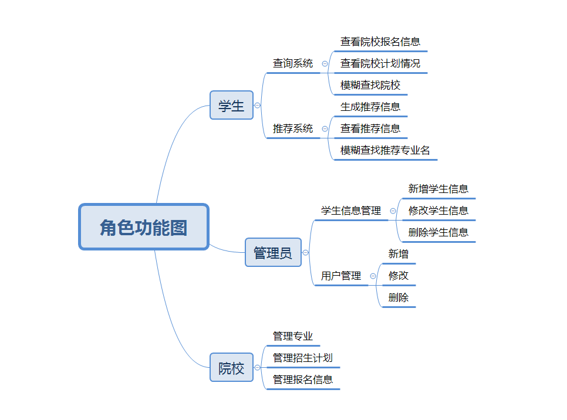
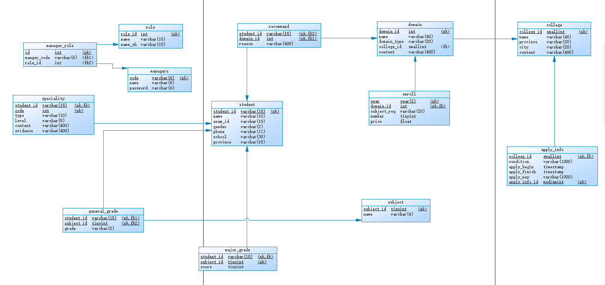
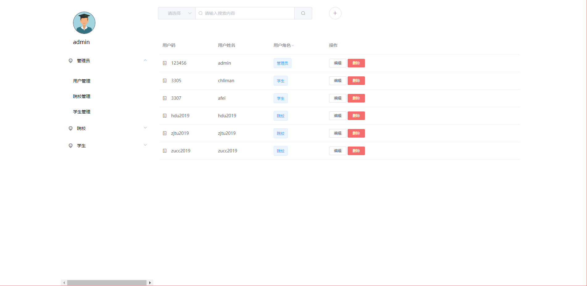
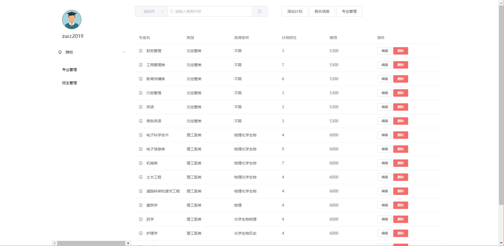
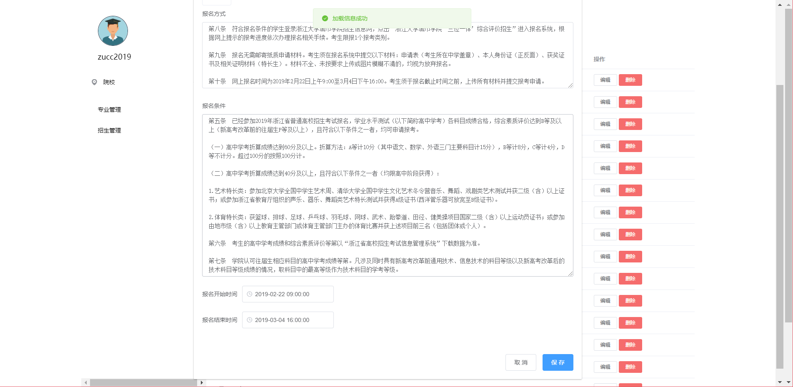
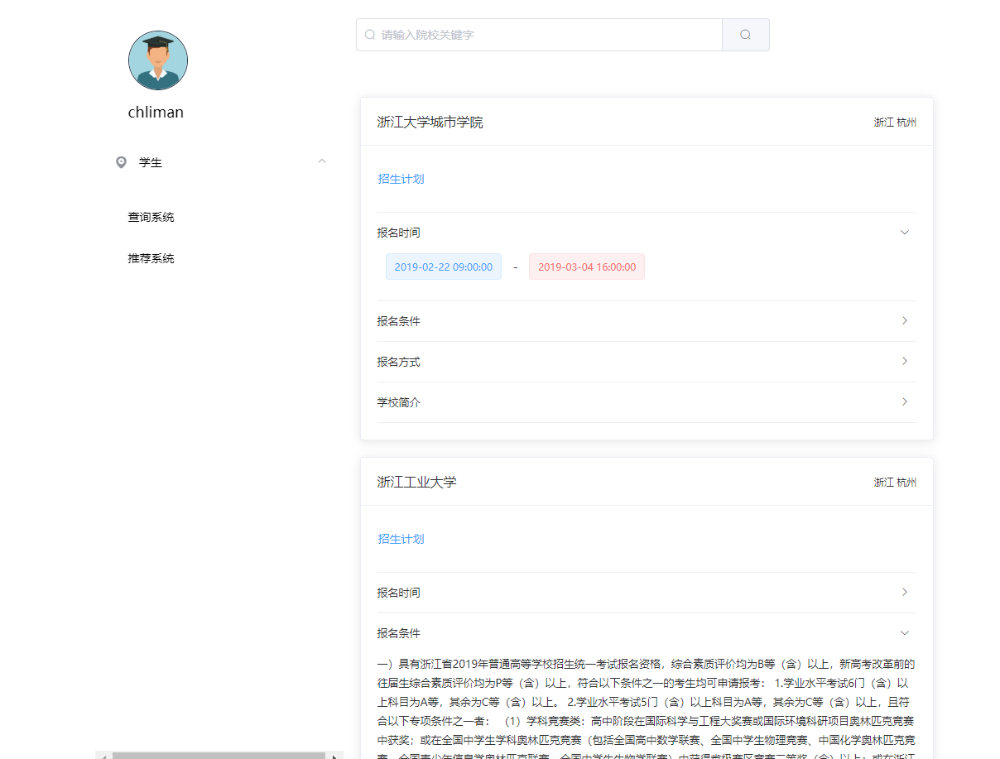
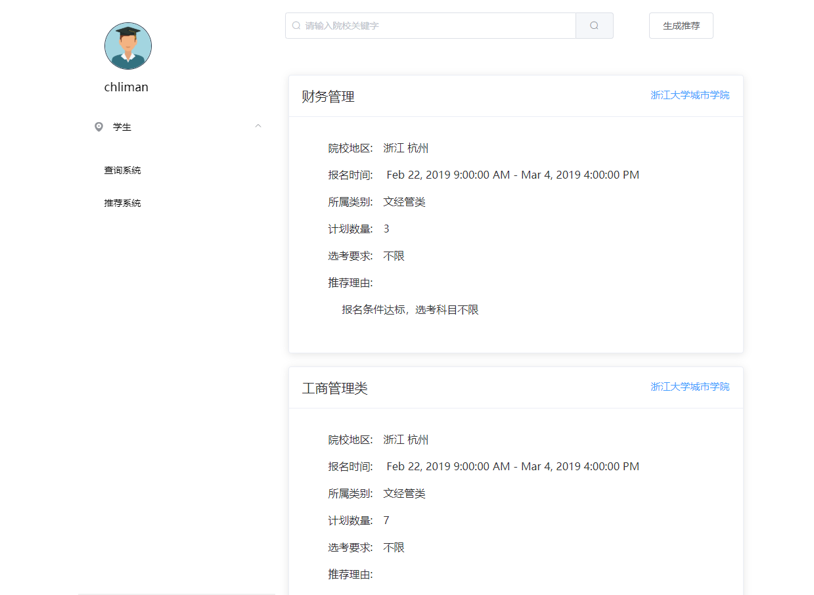

# Trinity

## 介绍

一个招生系统，要求从维护对学校、专业、招生、报名、科目还有考生等信息的维护，并能根据考生的信息匹配出学校和专业。设计数据库，并用Mysql作为数据库，服务端采用Spring Boot + MyBaties，前端采用Vue + Element UI。

## 完成情况

1. 完成招生信息的维护，功能包括：对于学校，专业，招生，报名，科目等实体和相关联系的信息维护（增、删、改等功能）并有必要的判断功能（例如删除学校的时候，如果有相关专业存在，就要给出提示，并禁止删除）

2. 完成对考生信息的维护，功能包括：对个人，学考成绩，特长，选考信息等实体和相关联系的信息维护（增、删、改等功能）并有必要的判断功能（例如删除学校的时候，如果有相关专业存在，就要给出提示，并禁止删除）

3. 根据输入的考生、招生信息，给考生推荐合适的学校和专业，并给出推荐理由

4. 可以根据招生院校、专业、考生信息进行模糊查询，并且可以显示查询到的院校、专业及考生的完整信息及相关信息

5. 至少提供3个高校的完整招生方案，并给出相应的推荐结果

根据基础的功能要求，我们可以看出本项目的用户类型分为管理员，院校，学生，系统会根据登录的角色给出不同的操作权限，按角色区分功能如下：

## 表结构设计PDM图

## 界面设计

### 登录界面：

### 管理员界面：

### 院校管理界面：

### 学生查询界面：

### 推荐系统界面：
 